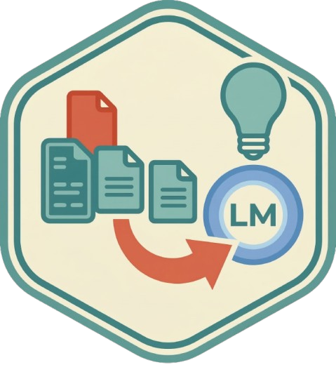
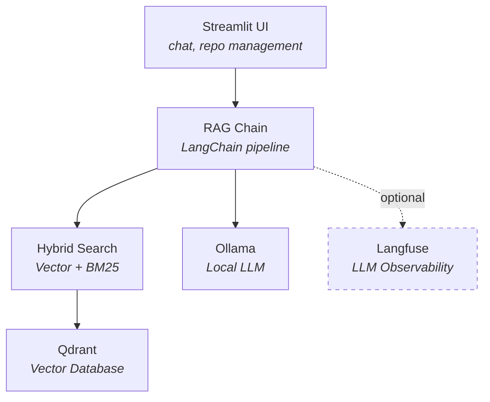

<p align="center">
  
</p>

<h1 align="center">Codebase RAG</h1>

<p align="center">
  <strong>Ask questions about any codebase. Runs entirely on your machine.</strong><br>
  Built with LangChain · Qdrant · Ollama · Streamlit
</p>

<p align="center">
  <a href="https://github.com/aschiltmansnavara/codebase-rag/actions/workflows/ci.yml"></a>
  
  <a href="https://www.python.org/downloads/"></a>
  <a href="https://github.com/astral-sh/ruff"></a>
  <a href="LICENSE"></a>
</p>

## Why This Project?

- **Fully local.** Runs entirely on your machine. Your code never leaves your hardware.
- **Hybrid retrieval.** Dense vector search + BM25 keyword search, with better recall than either on its own.
- **Evaluated, not just vibes.** Ships with a reproducible evaluation framework (16 questions, two model sizes, detailed metrics). See [Evaluation Results](docs/evaluation-results.md).
- **Observable.** Optional Langfuse integration traces every retrieval and generation step, so you can debug quality issues instead of guessing.
- **Documented decisions.** Architecture Decision Records explain *why* each technology was chosen, not just *what* was used. See the [ADR index](docs/adr-index.md).
- **Batteries included.** `make services-start` gives you the app, vector DB, LLM server, and tracing dashboard. No manual setup.

## Features

**Retrieval Design**
- **Hybrid search.** Weighted combination of vector similarity (0.7) and BM25 keyword search (0.3), with score normalization and re-ranking.
- **Language-aware chunking.** Naively splitting code by token count breaks at arbitrary lines, destroying context. Python-specific and Markdown-aware splitting preserves logical code units (functions, classes, sections).
- **Source citations.** Every answer includes the source files and repositories it drew from, so answers are verifiable.

**Infrastructure Choices**
- **Fully local stack.** Ollama for inference, Qdrant for vectors, SQLite for chat history. No external API calls, no data egress.
- **Multi-repo ingestion.** Clone and index any public GitHub repository from the UI or CLI.
- **Idempotent ingestion.** Content hashing and deterministic chunk IDs prevent duplicates on re-ingestion, safe to run repeatedly in scheduled jobs or CI.

**Developer Experience**
- **Local LLM inference.** Runs against Ollama with any model; ships with `sam860/LFM2:350m` by default.
- **Conversation memory.** Multi-turn conversations with persistent SQLite-backed chat history.
- **LLM observability.** Optional Langfuse integration for tracing retrieval and generation with per-span metrics.

## Architecture



**Data flow:**

1. **Ingest.** `GitLoader` clones a repo → `DocumentProcessor` splits files into chunks using language-specific strategies → chunks are embedded with `sentence-transformers/all-mpnet-base-v2` and stored in Qdrant, with a parallel BM25 index built for keyword search.
2. **Retrieve.** User query hits the `HybridRetriever`, which merges vector and BM25 results, re-ranks, and returns the top-k documents above a relevance threshold.
3. **Generate.** Retrieved documents are formatted into a context prompt and sent to Ollama. The `RAGChain` handles conversation memory, prompt construction, and Langfuse tracing.
4. **Persist.** Chat history is stored in SQLite. Vector data lives in Qdrant. Both survive container restarts via Docker volumes.

## Project Structure

```
codebase-rag/
├── src/codebase_rag/
│   ├── app/              # Streamlit UI (main.py, components.py)
│   ├── config.py         # Environment-based configuration (singleton)
│   ├── data_ingestion/   # Git cloning, document processing, chunking
│   ├── database/         # Qdrant store, SQLite chat storage, embeddings
│   ├── llm/              # Ollama client, RAG chain with Langfuse tracing
│   └── retrieval/        # Vector search, BM25 search, hybrid retriever
├── Makefile              # Development task runner (make help)
├── scripts/
│   └── ingest.py         # Repository ingestion pipeline (single and multi-repo)
├── docker/
│   ├── compose-dev.yml   # Full-stack Docker Compose
│   ├── Dockerfile        # App container (Python 3.12)
│   └── entrypoint.sh     # Auto-ingest + model pull on first boot
├── evals/                # Evaluation framework and results
├── tests/                # Unit, integration, e2e, performance tests
└── docs/                 # ADRs and design documentation
```

## Getting Started

Quick start: `make services-start` → open http://localhost:8501.

See the [setup guide](docs/getting-started.md) for Docker and local installation, repository ingestion, and example queries.

## Configuration

All settings are configured via environment variables or `.env`. See the full [configuration reference](docs/configuration.md).

## Development

The `Makefile` is the primary development interface. Run `make help` for the full list.

## License

This project is licensed under MIT. See the [LICENSE](LICENSE) file for details.
